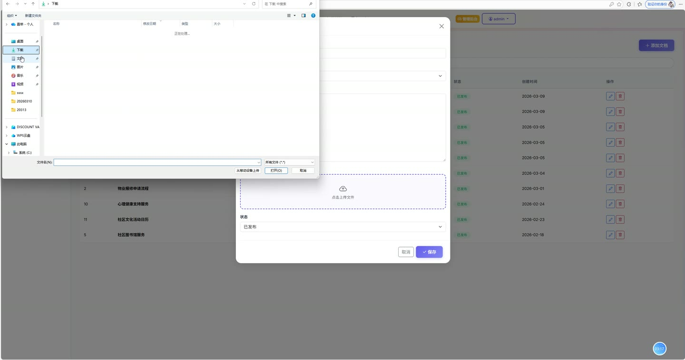
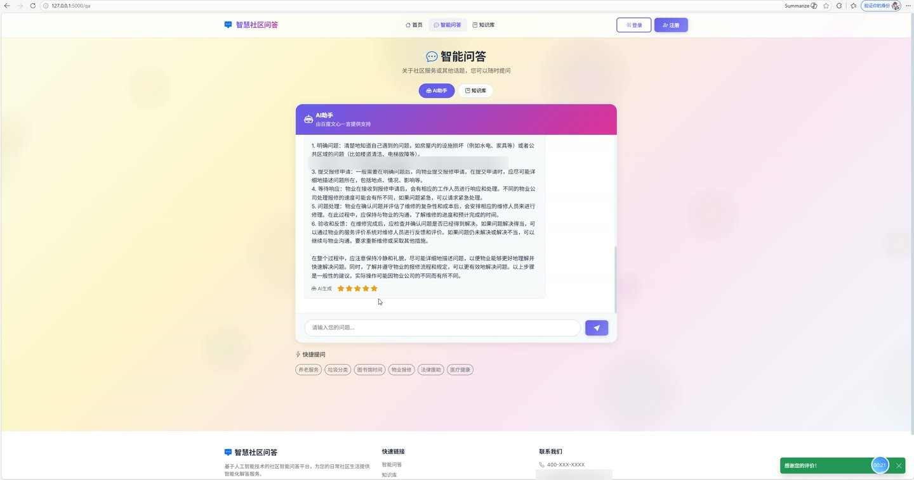
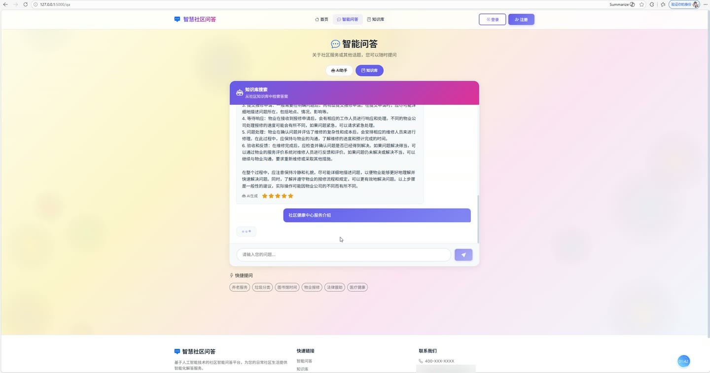
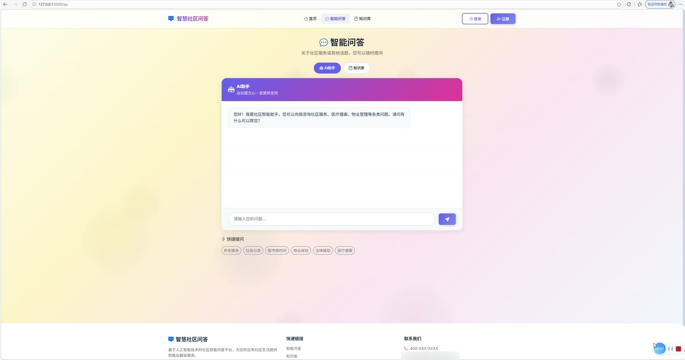
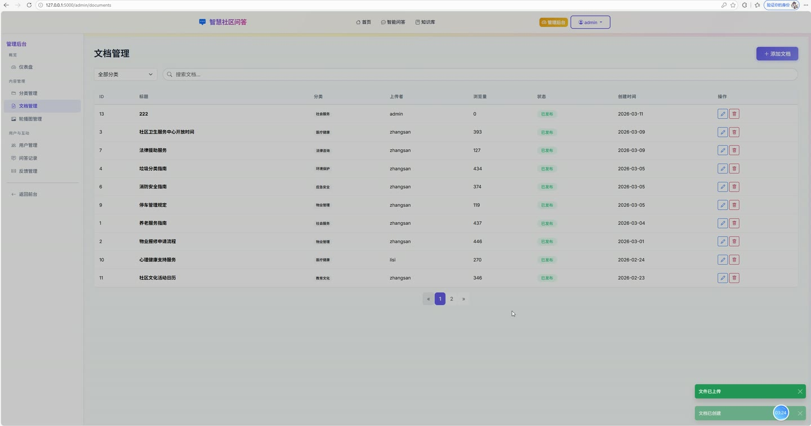

# (附文档)Python+Flask+MySQL 基于大模型的社区智能问答系统设计与实现

**技术栈**：Python、Flask、MySQL

### 系统简介

本系统是一套基于大模型的社区智能问答平台，采用前后端分离架构，后端使用 Python + Flask 提供 RESTful 接口，前端为原生 SPA 单页应用。系统包含普通用户端与管理员端两类角色，围绕社区知识库、智能问答、反馈处理、轮播图管理等场景构建，支持对接百度千帆大模型实现 AI 问答，并结合本地知识文档进行知识型问答检索。
 
### 核心功能
 
### 普通用户端

 
- 用户注册：填写用户名、邮箱、密码完成账号创建，密码经哈希加密后写入 users 表。 
- 用户登录：通过用户名与密码校验身份，登录状态由 Flask-Login 会话维护。 
- 个人资料查看：读取当前登录用户的用户名、邮箱、头像、角色、注册时间与账号状态。 
- 智能问答：在问答页输入问题，系统调用大模型接口返回答案，并写入 qa_records 表。 
- 知识型问答：基于本地知识文档内容检索匹配，返回带来源文档的答案，qa_type 标记为 knowledge。 
- 问答记录查看：按用户维度查询历史问答列表，展示问题、答案、类型与时间。 
- 问答评分：对已生成的问答记录进行 1-5 星评分，rating 字段落库保存。 
- 知识分类浏览：查看知识分类列表，展示分类名称、描述、图标与文档数量。 
- 知识文档浏览：按分类查看已发布文档列表，支持查看文档标题、内容、上传者与浏览量。 
- 文档浏览量统计：每次打开文档详情时对 view_count 字段进行累加。 
- 文档附件下载：对带 file_path 的文档，可通过 /uploads 路径下载上传的附件文件。 
- 意见反馈提交：填写反馈内容并选择反馈类型（建议/缺陷/其他），写入 feedbacks 表。 
- 反馈记录查看：查看本人提交的反馈列表及其处理状态与管理员回复内容。 
- 首页轮播浏览：读取 banners 表中启用状态的轮播图，展示标题、图片与跳转链接。
 
### 管理员端

 
- 用户管理：查看全部用户列表，展示用户名、邮箱、角色、状态与注册时间。 
- 用户状态控制：对指定用户执行启用或禁用操作，修改 status 字段（1 启用 / 0 禁用）。 
- 用户角色管理：调整用户 role 字段，在 user 与 admin 之间切换。 
- 知识分类管理：新增分类，填写名称、描述、图标与排序值。 
- 知识分类编辑与删除：修改已有分类信息或删除分类记录。 
- 知识文档管理：新增文档，填写标题、正文内容并选择所属分类。 
- 文档附件上传：上传文档附件文件，保存路径写入 file_path 字段。 
- 文档发布状态控制：切换文档 status 字段，在已发布与草稿之间变更。 
- 文档编辑与删除：修改文档标题、内容、分类，或删除文档记录。 
- 问答记录管理：查看全站问答记录，展示提问用户、问题、答案、类型与评分。 
- 问答记录删除：对指定问答记录执行删除操作。 
- 反馈处理：查看全部用户反馈，按类型与状态筛选。 
- 反馈回复：填写 reply 内容并将 status 由 pending 更新为 resolved。 
- 轮播图管理：新增轮播图，填写标题、图片地址、跳转链接与排序值。 
- 轮播图状态控制：切换 status 字段控制轮播图启用或禁用。 
- 轮播图编辑与删除：修改轮播图信息或删除轮播记录。
 
### 技术栈

 后端框架Python + Flask ORMFlask-SQLAlchemy 权限认证Flask-Login + Werkzeug 密码哈希 跨域处理Flask-CORS 大模型接入百度千帆大模型 API（IAM 安全认证） 向量检索Chroma 向量库持久化存储 前端框架原生 JavaScript 单页应用（SPA Router） UI 组件Bootstrap + Bootstrap Icons 数据库MySQL 8.0（utf8mb4） 文件上传Flask 静态目录 + uploads 目录托管
 
### 交付内容

 
- 后端完整源码 
- 前端完整源码 
- 数据库初始化脚本 
- 万字文档

## 界面展示

---

## 获取完整源码 + 万字文档

本仓库为项目介绍页。**完整前后端源码、数据库初始化脚本、万字项目文档**，请加微信 `kangkangcode`，或访问 [codekk.top](http://codekk.top) 获取。

可作课程设计 / 毕业设计参考，支持远程部署调试。